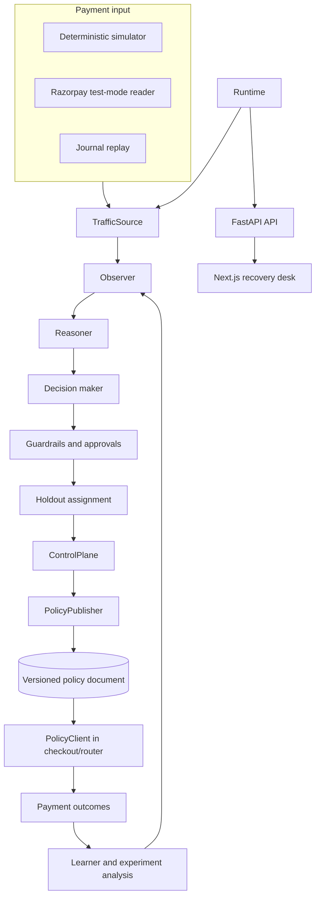

# Architecture

Flowstate is a closed-loop payment recovery system. It is intentionally split
into a **decision plane** and a **routing plane**: Flowstate decides and
publishes a versioned policy; the checkout or routing client consumes that
policy. The agent does not call a payment provider to alter a transaction.

## Overview

## Runtime and product surface

`src/runtime.py` owns one agent lifecycle and one read model. It runs the
traffic source, processes a batch, publishes a consistent snapshot, and powers
the deterministic demonstration. `api/main.py` exposes that snapshot and
operator actions. The Next.js desk uses the API proxy route, so a browser does
not need direct access to the Python service or provider credentials.

| Layer | Responsibility | Main code |
| --- | --- | --- |
| Product | Read model and operator actions | `frontend/`, `api/main.py` |
| Runtime | Lifecycle, scenarios, deterministic demo | `src/runtime.py` |
| Detection | Windows, rate estimates, change detection | `src/agent/observer.py`, `src/agent/reasoner.py` |
| Decision | Rank an allowed response and preserve alternatives | `src/agent/decision_maker.py` |
| Safety | Authorization, approval, blast-radius and rate limits | `src/safety/`, `src/models/state.py` |
| Control | Versioned policy and durable publication | `src/control/plane.py`, `src/control/publish.py` |
| Measurement | Treatment/control assignment and comparison | `src/analysis/experiment.py`, `src/analysis/statistics.py` |
| Evidence | Events, outcomes, and replay | `src/store/journal.py` |

## Recovery loop

1. **Observe** — a sliding window tracks outcomes by issuer, payment method,
   region, and decline code.
2. **Reason** — sequential detection and Bayesian rate estimates identify a
   sustained change rather than reacting to a single error.
3. **Decide** — permitted responses are ranked on success rate, latency, cost,
   and risk. The response that is not to act is scored as an explicit option.
4. **Guard** — authorization, approval requirements, limits, and a concurrent
   holdout are applied before publication.
5. **Publish** — a new, attributed control-plane revision is written
   atomically for an external routing client.
6. **Measure** — outcomes for treated traffic are compared with the holdout.
   A recovery claim is displayed only when the data is sufficient and the
   comparison is significant.

## Safety and auditability

Every action type is classified in `ACTION_AUTHORIZATION` in
`src/models/state.py`. The guardrails use that single classification for the
runtime, tool layer, and API path.

| Level | Examples | Requirement |
| --- | --- | --- |
| Automatic | Retry tuning, alerts | Safety limits and confidence threshold |
| Semi-automatic | Circuit breaker, routing change | Operator approval unless explicitly low risk |
| Manual | Payment-method suppression | Operator approval |

An approval expires rather than approving itself. The control-plane revision
records the decision-maker, reason, expiry, and policy version. Publication is
atomic, and `PolicyClient` retains the last valid policy if a read fails.

## Measurement model

Affected transactions are assigned deterministically to treatment or holdout
using the transaction identifier. This avoids a before/after comparison that
could confuse the recovery response with a naturally resolving incident.

The experiment records both count and value. It reports value at risk,
treatment and control outcomes, and recovered value versus control. The system
does not report a monetary recovery when it lacks a sufficient sample or a
significant result.

## Sources and integration boundary

`TrafficSource` provides one batch interface for the simulator, recorded
journals, and payment gateway readers. `src/traffic/gateway.py` maps provider
records to the shared transaction model and declares unavailable signals rather
than fabricating them.

The Razorpay connector is read-only and intended for test mode. It uses local
API-service environment variables, never browser-supplied keys. Payment-list
records carry status, issuer, and failure data, but not treatment/control
attribution; governed recovery measurement therefore remains in the simulator
until the routing system returns those tags.

## Reliability

The journal persists transactions, patterns, decisions, outcomes, and policy
revisions. A recorded incident can be replayed against a changed agent version.
On restart, the runtime adopts an active published policy as a new revision so
an intervention is not silently forgotten.

The optional advisor in `src/agent/advisors.py` explains an incident for the
operator. It has no tools and cannot alter the decision path. If unavailable,
the detection, policy, and measurement loop continue unchanged.

It is enabled by `GEMINI_API_KEY` on the API service, read from the environment
or from a local `.env` by `src/utils/env.py`; a value already exported always
wins over the file. The key never reaches the browser, which talks only to the
Next.js proxy. `views.snapshot` reports `agent.advisor` and
`agent.advisor_model`, and the desk uses them to attribute each assessment, so a
missing or failing model is visible rather than silently indistinguishable from
detector output.

## Known boundary

The shipped demonstration uses synthetic traffic. Its purpose is to make the
entire decision and measurement path reproducible. It is not a claim of
production performance on a merchant's live traffic.

## Extension points

- Add a traffic source by implementing `next_batch`, `describe`, and `signals`.
- Add an action by classifying it in `ACTION_AUTHORIZATION`, safety rules, and
  the control plane before it is available to the decision maker.
- Add a gateway mapper with a recorded payload fixture in `tests/fixtures/`.
- Add a detector with an explicit false-alarm evaluation in
  `src/analysis/statistics.py`.
