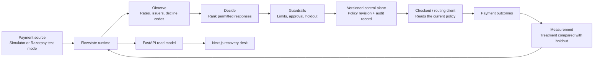

# Flowstate

**Payment recovery with evidence.** Flowstate spots a sustained payment
degradation, chooses a bounded response, records what changed, and compares
the result with an untreated holdout before it claims value recovered.

The product consists of a Next.js operations desk and a FastAPI runtime. It is
designed to make the recovery decision inspectable: what failed, why the
response was chosen, what required approval, and whether it actually helped.

## What to see first

1. Start the product and open `http://localhost:3000`.
2. Select **Run demo**.
3. Watch the incident appear, the routing response be evaluated, and the
   recovery result populate against the control group.

The demonstration is deterministic, so the same scenario and measurement are
reproducible for a review or recorded walkthrough.

## System architecture



The runtime never edits a payment provider directly. It publishes a versioned
policy for an external routing client, making every action reversible and
auditable. See [ARCHITECTURE.md](ARCHITECTURE.md) for the detailed design.

## Run locally

Prerequisites: Python 3.11+, Node.js 20+, and pnpm.

```bash
pip install -r requirements.txt
uvicorn api.main:app --reload
```

In a second terminal:

```bash
cd frontend
pnpm install
pnpm dev
```

Open `http://localhost:3000`. The frontend proxies agent requests to
`http://localhost:8000` by default.

## Run with Docker

```bash
docker compose up --build
```

This starts the recovery desk on port `3000` and the API on port `8000`.
Stop both with `docker compose down`.

## API surface

| Endpoint | Purpose |
| --- | --- |
| `GET /health` | Service health |
| `GET /snapshot` | Consistent operations read model |
| `POST /demo/run` | Run the deterministic demonstration |
| `POST /scenarios/inject` | Create a simulated payment incident |
| `POST /approvals/{request_id}/approve` | Approve a queued action |
| `POST /approvals/{request_id}/deny` | Reject a queued action |
| `POST /sources/razorpay/test-mode` | Switch to read-only Razorpay test-mode intake |

Interactive API documentation is available at `http://localhost:8000/docs`.

## Razorpay test-mode intake

Flowstate can ingest Razorpay test-mode payment records without sending a
payment action to Razorpay. Set these variables on the API service, then call
`POST /sources/razorpay/test-mode`:

```text
RAZORPAY_TEST_KEY_ID=rzp_test_...
RAZORPAY_TEST_KEY_SECRET=...
RAZORPAY_MERCHANT_ID=your-test-merchant
```

Docker Compose forwards these values from your local shell; do not place them
in the repository. The browser never receives the credentials. Razorpay's
payment list supplies status, decline code, and issuer data. It does not carry
treatment/control attribution, so recovery measurement stays in the governed
simulator until the production router returns those tags.

## Repository map

```text
api/          FastAPI transport and lifecycle hooks
config/       Agent, simulator, and safety configuration
frontend/     Next.js product frontend
src/          Agent loop, policies, analysis, simulation, and runtime
tests/        Behavioural and documentation regression tests
```

## Verification

```bash
pytest
cd frontend && pnpm build
docker compose config --quiet
```

The agent core does not depend on scientific-computing libraries. FastAPI and
PyYAML support the service and configuration layers.
